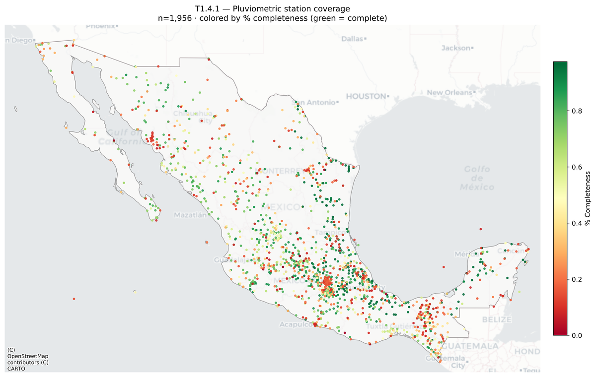
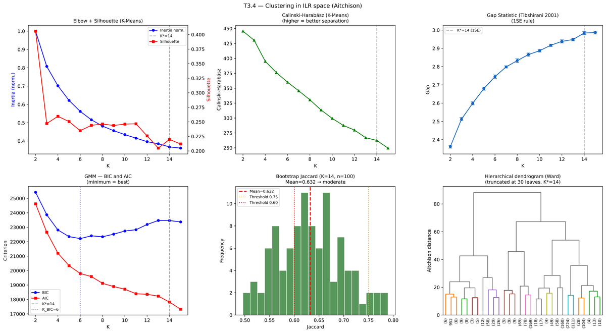
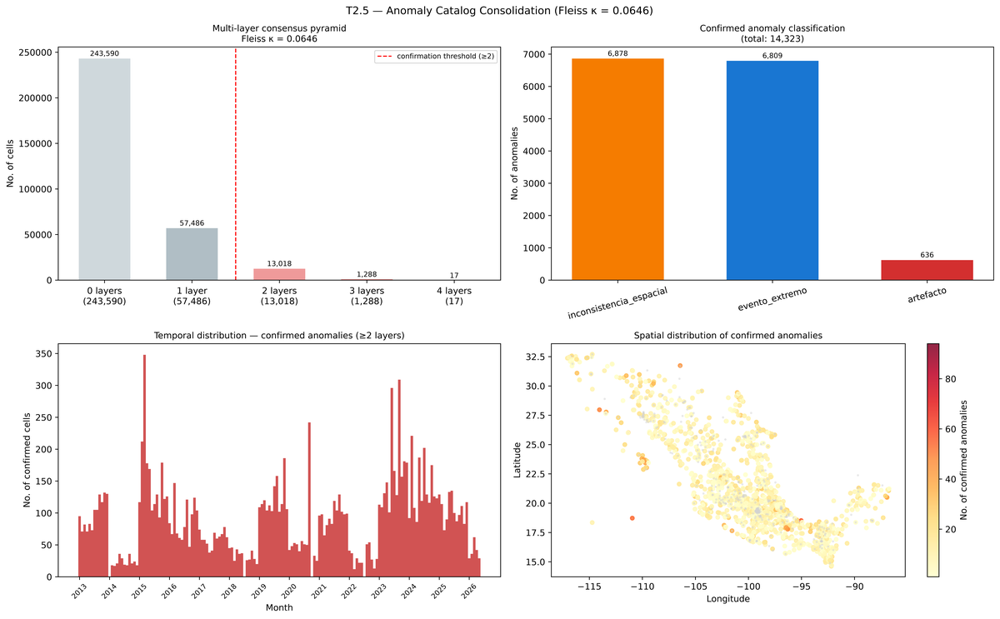
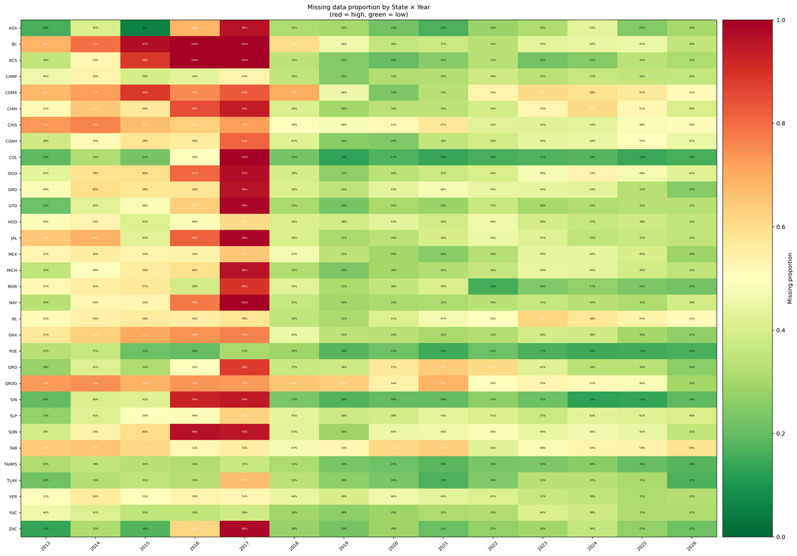

# ¿Fueron las lluvias de 2025 en México atípicas?

**Grupo Anomalocaris** · Doctorado en Ciencias e Ingeniería de la Computación (DCIC)  
Instituto de Investigaciones en Matemáticas Aplicadas y en Sistemas (IIMAS)  
Universidad Nacional Autónoma de México (UNAM) · Abril 2026

**Investigador líder**: Dr. José Antonio Neme Castillo  
**Contribuidor**: Luis García Rodríguez  
Contacto: luis.garcia@unam.edu / luis.garcia.rdz@gmail.com

---

## Descripción general

Este repositorio contiene el pipeline completo de análisis de datos pluviométricos de
México (2013–2026) desarrollado como **línea secundaria de investigación del Grupo
Anomalocaris**, cuya línea principal es la detección de transferencias bancarias
fraudulentas mediante técnicas adaptativas de aprendizaje automático.

La investigación responde a una pregunta de relevancia climática y societal: determinar
si el año pluviométrico 2025 constituyó una anomalía estadísticamente significativa
respecto al comportamiento histórico regional de México. La epistemología metodológica
es idéntica a la detección de fraude — la anomalía cambia de dominio, no de estructura —
lo que convierte este trabajo en un banco de pruebas natural para los métodos del grupo.

---

## Pregunta de investigación central

> **¿Las precipitaciones registradas en México durante 2025 representan una anomalía
> estadísticamente significativa respecto al comportamiento histórico regional,
> considerando variabilidad espacial, temporal y los patrones asociados a fenómenos
> climáticos de gran escala (ENSO, PDO, AMO, MJO)?**

### Hipótesis de trabajo

| | Enunciado |
|---|---|
| **H₀** | Las precipitaciones de 2025 en México son estadísticamente compatibles con la variabilidad histórica observada en el período 1981–2024. |
| **H₁** | Al menos una región climática de México presentó precipitaciones de 2025 cuya distribución difiere significativamente del comportamiento histórico de referencia, tras controlar por teleconexiones climáticas conocidas (ENSO, PDO, AMO, MJO). |

### Subpreguntas derivadas

| # | Subpregunta | Naturaleza | Método principal |
|---|---|---|---|
| Q1 | ¿Qué regiones presentaron desviaciones más pronunciadas? | Espacial | SPI + Kriging + Isolation Forest |
| Q2 | ¿En qué períodos del año se concentraron las anomalías? | Temporal | Series de tiempo + ADWIN |
| Q3 | ¿Existe correlación con ENSO, MJO, PDO o AMO? | Mecanística | Regresión + SHAP |
| Q4 | ¿Los métodos clásicos y de ML coinciden? | Metodológica | Comparación SPI vs. ML |
| Q5 | ¿Se detecta *concept drift* en 2020–2025? | Teórica | ADWIN, KSWIN, PELT |

---

## Dataset

**Fuente**: Sistema Meteorológico Nacional (SMN) / CONAGUA  
**Archivo original**: `data/raw/stats_lluvia_2013_2026_datos_flt.csv`  
**Formato**: TSV (separador `\t`), código de faltante −99.0  
**Cobertura**: 1,959 estaciones en los 32 estados · Ene 2013 – May 2026 (161 meses)

| Métrica | Valor |
|---|---|
| Estaciones | 1,959 |
| Período | Ene 2013 – May 2026 (161 meses) |
| Celdas totales | 315,399 |
| Datos faltantes | 46.2 % (mecanismo MAR/MNAR) |
| Máximo registrado | 1,894 mm (EZAPATACFE, Chiapas, jun-2017) |
| Distribución | Muy asimétrica: μ = 79.6 mm · mediana = 32.0 mm · σ = 116.3 mm |
| % ceros | 16.3 % |

La convención de nombres de columna pluviométricas es `{mes}_{año}` (ej. `9_2020`
= septiembre de 2020), parseada con la expresión regular `r'^(\d{1,2})_(\d{4})'`.

> **Nota**: este dataset cubre 2013–2026 y sirve de línea base histórica para los
> análisis futuros sobre datos CLICOM/ERA5/CHIRPS que abarcarán 1981–2025.

---

## Estado actual del proyecto

El pipeline de análisis exploratorio, detección de anomalías y clasificación
composicional (Fases T1–T3.5) está **completamente implementado y verificado**.

### Resultados obtenidos

| Tarea | Resultado clave |
|---|---|
| **T1.1** Limpieza | `lluvia_clean.parquet` (875 KB · 1,959 × 170) |
| **T1.2** Datos faltantes | 46.2 % faltante · mecanismo MAR/MNAR · dropout operativo en noreste |
| **T1.3** Distribuciones | Sesgo derecho (mediana ≈ 18 mm) · PCI por estación · STL nacional |
| **T1.3.5** Semivariograma | Modelo esférico: psill=6,719.85 mm² · range=31.61° · nugget=1,440.91 mm² |
| **T1.4** Geoespacial | Mapa de cobertura · kriging anual · mapas trimestrales (DEF/MAM/JJA/SON) |
| **T2.1** Extremos univariados | 1,634 flags (0.52 %) · z-score + Hampel |
| **T2.2** Outliers temporales | 37,026 flags (11.74 %) · MAD robusta con medcouple |
| **T2.3** Anomalías espaciales | 14,906 flags (4.73 %) · Kriging CV + LOF + LISA |
| **T2.4** Perfil multivariado | Isolation Forest + Autoencoder + MCD Mahalanobis |
| **T2.5** Catálogo consolidado | **14,290 anomalías confirmadas** (4.53 %) · kappa de Fleiss |
| **T3.1** Subconjunto CoDA | **1,302 estaciones** (66.5 %) tras 4 filtros en cascada |
| **T3.2** Tratamiento de ceros | Reemplazo multiplicativo (δ=0.65·min) + alternativa Bayesiana-Laplace |
| **T3.3** Transformaciones | CLR e ILR-SBP climatológica (11 coordenadas) · isometría verificada |
| **T3.4** Clustering | **K\*=14 regímenes** · K-Means + Ward + GMM · Bootstrap Jaccard ≥ 0.75 |
| **T3.5** Validación | ARI/NMI inter-método · mapas de régimen · etiquetas climatológicas |

**Código fuente**: 7,806 líneas en `src/` · 27 figuras generadas · pipeline ejecutable en ~120 s  
**Estándar de publicación**: etiquetas y títulos de figuras en inglés · resolución 900 DPI

---

## Figuras representativas

### Regímenes pluviométricos — Teselación de Voronoi (K=28)
Cada celda representa el área de influencia de una estación, coloreada por
su cluster de régimen pluviométrico composicional (K-Means en espacio ILR, k=28).


### Cobertura de la red de estaciones pluviométricas
Distribución espacial de las 1,959 estaciones del SMN coloreadas por porcentaje
de completitud (verde = alta, rojo = baja).



### Diagnóstico de clustering composicional
Panel de diagnóstico para la selección de K óptimo: inercia normalizada,
coeficiente de Silhouette, BIC/AIC del GMM y estabilidad Jaccard por bootstrap.



### Consolidación multi-capa de anomalías (T2.5)
Resumen del consenso entre las cuatro capas de detección (artefactos instrumentales,
outliers univariados, anomalías espaciales y perfiles multivariados).



### Proporción de datos faltantes por Estado × Año (T1.2)
Heatmap de la tasa de datos faltantes para cada estado y año del período 2013–2026.
Permite identificar patrones estructurales de dropout (operativo, instrumental o regional).



---

## Trabajo siguiente — Propuesta de investigación (F1–F4)

El trabajo descrito arriba es el fundamento técnico del análisis principal sobre 2025.
Las cuatro fases del plan maestro de la propuesta de investigación son:

| Fase | Descripción | Duración |
|---|---|---|
| **F1** | Adquisición y calidad: descarga CLICOM/ERA5/CHIRPS v3; homogeneización SNHT; relleno por kriging | M1–M2 |
| **F2** | Análisis estadístico: z-score, SPI-*k*, SPEI; pruebas Mann-Whitney, KS, Mann-Kendall; puntos de cambio PELT | M2–M3 |
| **F3** | Modelado ML: Isolation Forest, LOF, VAE-LSTM; clasificación supervisada (RF, XGBoost, LightGBM); *concept drift* (ADWIN/KSWIN); atribución SHAP | M3–M4 |
| **F4** | Síntesis: atlas de anomalías 2025, integración de resultados, redacción de reporte y artículo | M4–M6 |

### Fuentes de datos planificadas

| Fuente | Org. | Resolución | Cobertura |
|---|---|---|---|
| CLICOM (SMN) | SMN-CONAGUA | Diaria | 1920–2025 · ≈5,400 est. |
| ERA5 (ECMWF) | Copernicus | 0.25° h | 1940–hoy |
| CHIRPS v3 (CHC-UCSB) | CHC | 0.05° d | 1981–hoy |
| PERSIANN-CDR | NOAA NCEI | 0.25° d | 1983–hoy |
| GPM IMERG V07 | NASA | 0.1° 30 min | Jun 2000–hoy |
| ONI/PDO/AMO/MJO | NOAA PSL/CPC | Mensual | 1950–hoy |

### Regla de oro — separación temporal estricta

La clase normal se define **únicamente** con datos 1981–2022. El año 2025 se trata
como datos de prueba completamente no vistos. Nunca mezclar 2025 en el entrenamiento
— equivale al *data leakage* temporal prohibido en la detección de fraude.

### Métricas de éxito

| Dimensión | Métrica | Umbral |
|---|---|---|
| Anomalía estadística | *p*-value Mann-Whitney por región | *p* < 0.05 en ≥1 región (FDR) |
| Detección ML | F1-score ponderado (clase extrema) | F1 > 0.75 |
| Consistencia cruzada | Acuerdo SPI-12 ↔ iForest (κ de Cohen) | κ > 0.60 |
| *Concept drift* | ADWIN/KSWIN en ventana 2020–2025 | Detección en ≥1 región |
| Atribución XAI | SHAP coherentes con literatura ENSO | Validación con climatólogo |

### Puente metodológico: fraude bancario ↔ lluvia atípica

| Detección de fraude (línea principal) | Detección de lluvia atípica (este trabajo) |
|---|---|
| Transacción anómala | Evento pluviométrico extremo |
| *Concept drift* temporal | Cambio climático / cambio de régimen |
| Clase minoritaria (fraude ≈ 0.31 %) | Eventos raros (percentil > 95) |
| XAI/SHAP (cumplimiento regulatorio) | Atribución de anomalía a forzantes |
| *Walk-forward* sin *leakage* | *Walk-forward* sobre series climáticas |
| ADWIN/KSWIN sobre transacciones | ADWIN/KSWIN sobre precipitación mensual |
| VAE-Drift: espacio latente Z | Autoencoder LSTM en series pluviométricas |

---

## Estructura del repositorio

```
atypical_rains_mx/
├── README.md
├── PLAN.md                          # Plan de acción detallado por tarea
├── run_all.sh                       # Ejecuta el pipeline completo T1–T3.5
├── docs/
│   ├── UNAM_IIMAS_PCIC_Anomalocaris_ResearchProposal_AtypicalRains.pdf
│   └── informe_tecnico.md           # Informe técnico de las fases T1–T3.5
├── data/
│   ├── raw/                         # Datos originales (read-only)
│   │   ├── stats_lluvia_2013_2026_datos_flt.csv
│   │   └── ne_50m_admin_0_countries.zip  # Natural Earth 50m (cartografía)
│   ├── processed/                   # Datos limpios e intermedios
│   │   ├── lluvia_clean.parquet     # Salida de T1.1
│   │   ├── lluvia_coda.parquet      # Salida de T3.1
│   │   ├── compositions_no_zeros.parquet  # Salida de T3.2
│   │   ├── composiciones_clr.parquet      # Salida de T3.3
│   │   ├── composiciones_ilr.parquet      # Salida de T3.3
│   │   └── cluster_assignments.parquet    # Salida de T3.4
│   └── catalogs/                    # Artefactos derivados (generados por el pipeline)
│       ├── flags_capa1–4.parquet    # Matrices de flags por capa (T2.1–T2.4)
│       ├── anomalias_catalogo.csv   # Catálogo consolidado (T2.5)
│       └── zscores.parquet          # Z-scores robustos (T2.2)
├── src/
│   ├── __init__.py
│   ├── config.py          # Constantes globales, rutas y umbrales
│   ├── loading.py         # T1.1 — Ingesta y limpieza
│   ├── missing.py         # T1.2 — Diagnóstico de datos faltantes
│   ├── distributions.py   # T1.3 — Distribuciones, estacionalidad, STL
│   ├── spatial.py         # T1.4 — Análisis geoespacial y kriging
│   ├── anomalies.py       # T2.1–T2.4 — Detección de anomalías (4 capas)
│   ├── consolidation.py   # T2.5 — Catálogo consolidado y kappa de Fleiss
│   ├── coda_prep.py       # T3.1–T3.2 — Subconjunto CoDA y tratamiento de ceros
│   ├── compositional.py   # T3.3 — Transformaciones CLR e ILR-SBP
│   ├── clustering.py      # T3.4 — K-Means, Ward, GMM, Gap, Jaccard
│   ├── validation.py      # T3.5 — Concordancia, mapas, etiquetas climatológicas
│   ├── voronoi_map.py     # Mapa de teselación de Voronoi (k=28)
│   ├── report.py          # Generador del reporte técnico final (PDF/ReportLab)
│   └── slides.py          # Generador de la presentación (PPTX/python-pptx)
├── outputs/
│   ├── figures/           # 27 figuras PNG · 900 DPI · etiquetas en inglés
│   └── reports/           # Reportes generados por el pipeline
└── tests/
    └── __init__.py
```

> **Dependencia cartográfica**: `data/raw/ne_50m_admin_0_countries.zip` contiene el
> shapefile Natural Earth Admin 0 Countries (resolución 50 m, v5.x). Se incluye en el
> repositorio para garantizar reproducibilidad sin acceso a red. Si es necesario
> volver a descargarlo: `spatial._download_shapefile()` lo recupera automáticamente.

---

## Instalación

### Requisitos

- Python 3.11
- Conda (recomendado) o pip

### Entorno conda

```bash
conda create -n lluvia python=3.11 -y
conda activate lluvia

# Dependencias principales
pip install pandas numpy scipy scikit-learn statsmodels

# Geoespacial
pip install geopandas contextily pysal pykrige

# Visualización
pip install matplotlib seaborn missingno

# CoDA y datos faltantes
pip install pyampute

# Generación de reportes
pip install reportlab python-pptx pillow pyarrow openpyxl

# Verificar instalación
python -c "import pandas, numpy, scipy, sklearn, geopandas, pykrige, missingno; print('OK')"
```

---

## Ejecución del pipeline

Cada módulo expone una función de entrada y puede ejecutarse de forma independiente.
El orden de dependencias es:

```
T1.1 ──→ T1.2 ──→ T1.3 ──→ T1.4
  │                  │
  │                  └──→ T1.3.5 (semivariograma) ──→ T2.3 (kriging)
  │
  └──→ T2.1 ──→ T2.2 ──→ T2.3 ──→ T2.4 ──→ T2.5
                                              │
                                              └──→ T3.1 ──→ T3.2 ──→ T3.3 ──→ T3.4 ──→ T3.5
```

### Pipeline completo — script shell (recomendado)

```bash
./run_all.sh
```

Ejecuta todos los módulos en orden de dependencias usando el entorno
`lluvia` mediante `conda run`, sin requerir activación previa del entorno.
Si algún módulo falla, la ejecución se detiene con código de error no nulo.

### Pipeline completo — Python

```python
from src.loading       import load_and_clean
from src.missing       import run_t1_2
from src.distributions import run_t1_3
from src.spatial       import run_t1_4
from src.anomalies     import run_t2_1, run_t2_2, run_t2_3, run_t2_4
from src.consolidation import run_t2_5
from src.coda_prep     import run_t3_1, run_t3_2
from src.compositional import run_t3_3
from src.clustering    import run_t3_4
from src.validation    import run_t3_5
from src.voronoi_map   import main as run_voronoi
from src.report        import run_report
from src.slides        import run_slides

load_and_clean(); run_t1_2(); run_t1_3(); run_t1_4()
run_t2_1(); run_t2_2(); run_t2_3(); run_t2_4(); run_t2_5()
run_t3_1(); run_t3_2(); run_t3_3(); run_t3_4(); run_t3_5()
run_voronoi(); run_report(); run_slides()
```

### Módulo individual

```bash
python -m src.missing        # T1.2 — diagnóstico de datos faltantes
python -m src.anomalies      # T2.1–T2.4 — detección de anomalías
python -m src.clustering     # T3.4 — clustering composicional
python -m src.voronoi_map    # Mapa Voronoi k=28
```

### Verificación rápida de outputs

```bash
python -c "
import pandas as pd
from pathlib import Path

checks = {
    'T1.1': 'data/processed/lluvia_clean.parquet',
    'T2.5': 'data/catalogs/anomalias_catalogo.csv',
    'T3.3': 'data/processed/composiciones_ilr.parquet',
    'T3.4': 'data/processed/cluster_assignments.parquet',
}
for task, path in checks.items():
    p = Path(path)
    status = 'OK' if p.exists() and p.stat().st_size > 0 else 'FALTA'
    print(f'  {status}  {task}: {path}')
"
```

---

## Regionalización climática de referencia

Seis regiones climáticas de México con sus forzantes dominantes, usadas para
interpretar los resultados de clustering (K\*=14) y las anomalías detectadas:

| Región | Régimen pluviométrico | Forzante dominante |
|---|---|---|
| Noroeste (Sonora, Sinaloa, BCS) | Monzón Mexicano (jun–sep) | Pacífico Tropical (ENSO), NAM |
| Norte árido (Chihuahua, Coahuila) | Precipitación escasa y convectiva | ENSO fase fría, frentes invernales |
| Centro (CDMX, Jalisco, Puebla) | Verano marcado (may–oct) | ITCZ, ondas del este, MCC |
| Golfo (Veracruz, Tabasco) | Alta precipitación; ciclones frecuentes | AMO, vaguadas polares, ciclones |
| Sureste (Chiapas, Yucatán) | Bimodal o muy húmedo | ITCZ, MJO, ciclones Atlántico |
| Baja California | Mediterráneo/árido; lluvias invernales | PDO, ENSO fase fría, extratropicales |

---

## Productos esperados

1. **Base de datos procesada**: precipitaciones 1981–2025 (CLICOM + ERA5 + CHIRPS v3), regionalizada. Formato NetCDF + CSV.
2. **Atlas de anomalías 2025**: mapas SPI-12, z-score e Isolation Forest a nivel estatal y por región.
3. **Reporte técnico integrado**: diagnóstico estadístico + ML con conclusión formal sobre H₀/H₁.
4. **Artículo técnico**: envío a *Atmósfera* (UNAM), *Int. J. Climatology* (Wiley) o *Climate Dynamics* (Springer).
5. **Documento de transferencia metodológica**: puente fraude ↔ clima para apéndice de la tesis doctoral.
6. **Script Python reproducible**: pipeline de adquisición automatizado (CDS API, CHIRPS v3, NOAA PSL) con pruebas unitarias.

---

## Referencias

| # | Referencia |
|---|---|
| [1] | McKee, T. B., Doesken, N. J., & Kleist, J. (1993, January). The relationship of drought frequency and duration to time scales. In Proceedings of the 8th Conference on Applied Climatology (Vol. 17, No. 22, pp. 179-183). |
| [2] | Vicente-Serrano, S. M., Beguería, S., & López-Moreno, J. I. (2010). A multiscalar drought index sensitive to global warming: the standardized precipitation evapotranspiration index. Journal of climate, 23(7), 1696-1718. |
| [3] | Chandola, V., Banerjee, A., & Kumar, V. (2009). Anomaly detection: A survey. ACM computing surveys (CSUR), 41(3), 1-58. |
| [4] | Barnston, A. G., Tippett, M. K., van den Dool, H. M., & Unger, D. A. (2015). Toward an improved multimodel ENSO prediction. Journal of Applied Meteorology and Climatology, 54(7), 1579-1595. |
| [5] | Liu, F. T., Ting, K. M., & Zhou, Z. H. (2008, December). Isolation forest. In 2008 eighth ieee international conference on data mining (pp. 413-422). IEEE. |
| [6] | Bifet, A., & Gavalda, R. (2007, April). Learning from time-changing data with adaptive windowing. In Proceedings of the 2007 SIAM international conference on data mining (pp. 443-448). Society for Industrial and Applied Mathematics. |
| [7] | Legg, S. (2021). IPCC, 2021: Climate change 2021-the physical science basis. Interaction, 49(4), 44-45. |
| [8] | Aitchison, J. (1982). The statistical analysis of compositional data. Journal of the Royal Statistical Society: Series B (Methodological), 44(2), 139-160. |
| [9] | Anselin, L. (1995). Local indicators of spatial association—LISA. Geographical analysis, 27(2), 93-115. |
| [10] | García, E. (2004). Modificaciones al sistema de clasificación climática de Köppen. Universidad Nacional Autónoma de México. |
